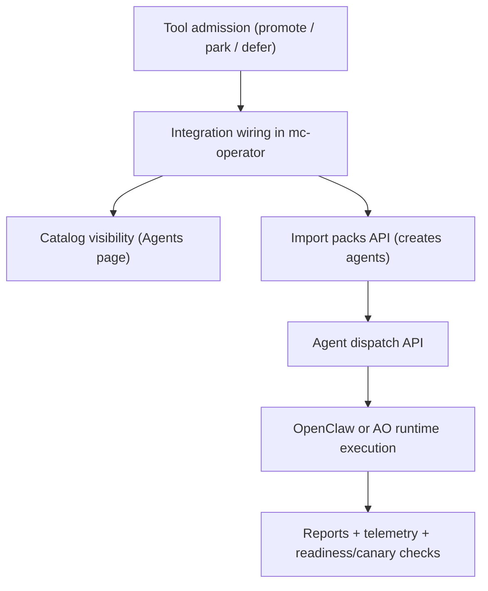

# Directive Forge Tool Workflow Cheat Sheet

Last updated: 2026-03-17

This is the practical runtime map for Directive Forge source packs inside Mission Control as the current host.

## End-to-end flow



## Integration modes

1. Pack as agent
- Tool content is imported as one or more `AgentDefinition` records.
- Runtime execution goes through `/api/agents/[id]/dispatch`.

2. Runtime tool
- Tool is used directly by scripts/checks (`npm run ...`) without creating imported agents.

## Promote tools and workflow

| Tool | Mode | How it works | Primary trigger |
|---|---|---|---|
| `agent-orchestrator` | Pack as agent + backend | AO-backed agents spawn sessions via AO service and can use run-targeted dispatch gates. | Dispatch AO agent from Agents UI or `POST /api/agents/{id}/dispatch` |
| `agency-agents` | Pack as agent | Imports curated role packs into runnable agents with source metadata. | `POST /api/agents/import-packs` with `sources:["agency-agents"]` |
| `promptfoo` | Runtime tool | Powers eval guard and regression checks in reliability pipelines. | `npm run eval:agents`, `npm run check:agent-evals` |
| `puppeteer` | Runtime tool | Drives UI smoke and browser validation checks. | `npm run ui:smoke`, `npm run check:ui-smoke` |
| `scripts` | Runtime tool | Canonical run-scoped tool path for active workspace runs is `desloppify-prototype`; `tooling-audit` is a deprecated compatibility alias. | `npx tsx scripts/slice-e-run-desloppify-prototype.ts` |
| `superpowers` | Pack as agent | Imported as `Superpowers Workflow Operator` to enforce bounded execution and verification cadence. | `POST /api/agents/import-packs` with `sources:["superpowers"]` |
| `software-design-philosophy-skill` | Pack as agent | Imported as `Design Philosophy Reviewer` for design-risk focused reviews. | `POST /api/agents/import-packs` with `sources:["software-design-philosophy-skill"]` |
| `skills-manager` | Pack as agent | Imported as `Skills Lifecycle Operator` for skills root/sync governance workflows. | `POST /api/agents/import-packs` with `sources:["skills-manager"]` |
| `impeccable` | Pack as agent | Imported as `Impeccable UI Builder` with `impeccable-ui` dispatch profile defaults for UI-focused execution. | `POST /api/agents/import-packs` with `sources:["impeccable"]` |
| `celtrix` | Pack as agent | Imported as `Celtrix Prototype Operator` to run short setup/prototype sprints before feature implementation. | `POST /api/agents/import-packs` with `sources:["celtrix"]` |

## Core routes and files

- Import packs route:
  - `C:/Users/User/.openclaw/workspace/mc-operator/src/app/api/agents/import-packs/route.ts`
- Dispatch route:
  - `C:/Users/User/.openclaw/workspace/mc-operator/src/app/api/agents/[id]/dispatch/route.ts`
- Tooling catalog:
  - `C:/Users/User/.openclaw/workspace/mc-operator/src/server/services/tooling-catalog-service.ts`
- Agent source-pack typing and normalization:
  - `C:/Users/User/.openclaw/workspace/mc-operator/src/types/agents.ts`
  - `C:/Users/User/.openclaw/workspace/mc-operator/src/server/repositories/agents-repo.ts`

## Practical commands

1. Import promoted pack tools plus prototype/UI packs:

```powershell
$body = @{
  sources = @("superpowers","software-design-philosophy-skill","skills-manager","impeccable","celtrix")
  syncExisting = $true
} | ConvertTo-Json
Invoke-RestMethod -Uri "http://localhost:3000/api/agents/import-packs" -Method Post -ContentType "application/json" -Body $body
```

2. List imported agents for these packs:

```powershell
$agents = (Invoke-RestMethod -Uri "http://localhost:3000/api/agents").agents
$agents | Where-Object { $_.sourcePack -in @("superpowers","software-design-philosophy-skill","skills-manager","impeccable","celtrix") } |
  Select-Object id,name,sourcePack,status,backend
```

3. Dispatch one imported agent:

```powershell
$agentId = "<agent-id>"
$body = @{ task = "Bounded validation task"; deepMode = $false } | ConvertTo-Json
Invoke-RestMethod -Uri "http://localhost:3000/api/agents/$agentId/dispatch" -Method Post -ContentType "application/json" -Body $body
```

4. Run reliability and orchestration gates:

```powershell
npm run check:orchestrator-readiness
npm run canary:nightly
```

## Status semantics

- `promote`: targeted for active integration and runtime use.
- `park`: intentionally retained after value extraction; not default runtime path.
- `defer`: blocked pending explicit trigger + acceptance criteria.
- `unclassified`: not yet admitted into promote/park/defer.
